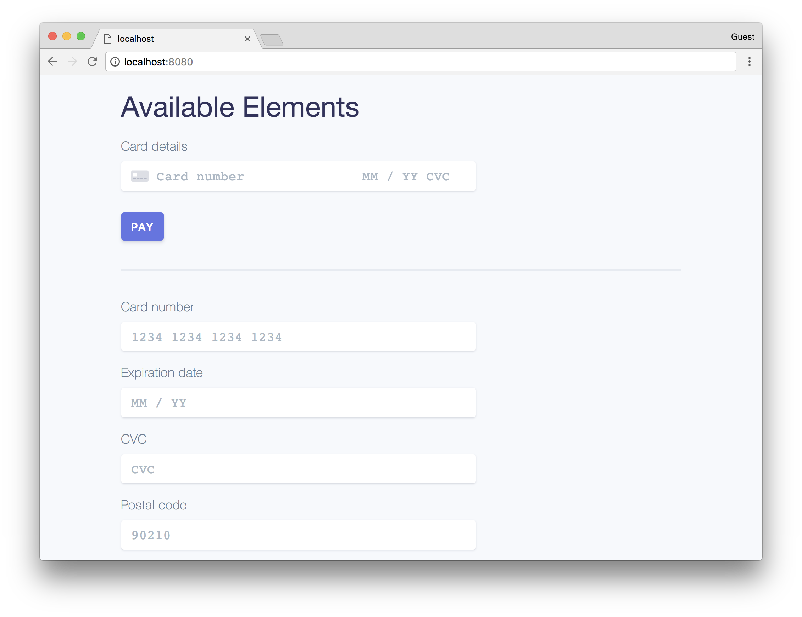

# react-stripe-elements

[](https://travis-ci.org/stripe/react-stripe-elements)
[](https://www.npmjs.com/package/react-stripe-elements)

> React components for Stripe.js and Stripe Elements

This project is a thin React wrapper around
[Stripe.js](https://stripe.com/docs/stripe.js) and
[Stripe Elements](https://stripe.com/docs/elements). It allows you to add
Elements to any React app, and manages the state and lifecycle of Elements for
you.

The
[Stripe.js / Stripe Elements API reference](https://stripe.com/docs/elements/reference)
goes into more detail on the various customization options for Elements (e.g.
styles, fonts).

<!-- prettier-ignore-start -->
<!-- START doctoc generated TOC please keep comment here to allow auto update -->
<!-- DON'T EDIT THIS SECTION, INSTEAD RE-RUN doctoc TO UPDATE -->
## Table of Contents

- [Demo](#demo)
- [Installation](#installation)
  - [First, install `react-stripe-elements`.](#first-install-react-stripe-elements)
  - [Then, load Stripe.js in your application:](#then-load-stripejs-in-your-application)
- [Getting started](#getting-started)
  - [The Stripe context (`StripeProvider`)](#the-stripe-context-stripeprovider)
  - [Element groups (`Elements`)](#element-groups-elements)
  - [Setting up your payment form (`injectStripe`)](#setting-up-your-payment-form-injectstripe)
  - [Using individual `*Element` components](#using-individual-element-components)
  - [Using the `PaymentRequestButtonElement`](#using-the-paymentrequestbuttonelement)
- [Advanced integrations](#advanced-integrations)
  - [Loading Stripe.js asynchronously](#loading-stripejs-asynchronously)
  - [Server-side rendering (SSR)](#server-side-rendering-ssr)
  - [Using an existing Stripe instance](#using-an-existing-stripe-instance)
- [Component reference](#component-reference)
  - [`<StripeProvider>`](#stripeprovider)
    - [Props shape](#props-shape)
  - [`<Elements>`](#elements)
    - [Props shape](#props-shape-1)
  - [`<*Element>` components](#element-components)
    - [Available components](#available-components)
    - [Props shape](#props-shape-2)
    - [Using `onReady`](#using-onready)
  - [`injectStripe` HOC](#injectstripe-hoc)
    - [Example](#example)
- [Troubleshooting](#troubleshooting)
- [Development](#development)

<!-- END doctoc generated TOC please keep comment here to allow auto update -->
<!-- prettier-ignore-end -->

## Demo

The fastest way to start playing around with `react-stripe-elements` is with
this JSFiddle: <https://jsfiddle.net/attystripe/xux7qzch/>.

You can also play around with the demo locally. The source code is in
[demo/](demo/). To run it:

```shell
git clone https://github.com/stripe/react-stripe-elements
cd react-stripe-elements

# (make sure you have yarn installed: https://yarnpkg.com/)

yarn install
yarn run demo
```

Now go to <http://localhost:8080/> to try it out!

> :warning: `PaymentRequestButtonElement` will not render unless the page is
> served over HTTPS. To demo `PaymentRequestButtonElement`, you can tunnel over
> HTTPS to the local server using ngrok or a similar service.



## Installation

### First, install `react-stripe-elements`.

Install with `yarn`:

```
yarn add react-stripe-elements
```

OR with `npm`:

```
npm install --save react-stripe-elements
```

OR using UMD build (exports a global `ReactStripeElements` object);

```html
<script src="https://unpkg.com/react-stripe-elements@latest/dist/react-stripe-elements.min.js"></script>
```

### Then, load Stripe.js in your application:

```html
<script src="https://js.stripe.com/v3/"></script>
```

## Getting started

### The Stripe context (`StripeProvider`)

In order for your application to have access to
[the Stripe object](https://stripe.com/docs/elements/reference#the-stripe-object),
let's add `StripeProvider` to our root React App component:

```js
// index.js
import React from 'react';
import {render} from 'react-dom';
import {StripeProvider} from 'react-stripe-elements';

import MyStoreCheckout from './MyStoreCheckout';

const App = () => {
  return (
    <StripeProvider apiKey="pk_test_12345">
      <MyStoreCheckout />
    </StripeProvider>
  );
};

render(<App />, document.getElementById('root'));
```

### Element groups (`Elements`)

Next, when you're building components for your checkout form, you'll want to
wrap the `Elements` component around your `form`. This groups the set of Stripe
Elements you're using together, so that we're able to pull data from groups of
Elements when you're tokenizing.

```js
// MyStoreCheckout.js
import React from 'react';
import {Elements} from 'react-stripe-elements';

import InjectedCheckoutForm from './CheckoutForm';

class MyStoreCheckout extends React.Component {
  render() {
    return (
      <Elements>
        <InjectedCheckoutForm />
      </Elements>
    );
  }
}

export default MyStoreCheckout;
```

### Setting up your payment form (`injectStripe`)

Use the `injectStripe` [Higher-Order Component][hoc] (HOC) to build your payment
form components in the `Elements` tree. The [Higher-Order Component][hoc]
pattern in React can be unfamiliar to those who've never seen it before, so
consider reading up before continuing. The `injectStripe` HOC provides the
`this.props.stripe` property that manages your `Elements` groups. You can call
`this.props.stripe.createToken` or `this.props.stripe.createSource` within a
component that has been injected to submit payment data to Stripe.

[hoc]: https://facebook.github.io/react/docs/higher-order-components.html

> :warning: NOTE `injectStripe` cannot be used on the same element that renders
> the `Elements` component; it must be used on the child component of
> `Elements`. `injectStripe` _returns a wrapped component_ that needs to sit
> under `<Elements>` but above any code where you'd like to access
> `this.props.stripe`.

```js
// CheckoutForm.js
import React from 'react';
import {injectStripe} from 'react-stripe-elements';

import AddressSection from './AddressSection';
import CardSection from './CardSection';

class CheckoutForm extends React.Component {
  handleSubmit = (ev) => {
    // We don't want to let default form submission happen here, which would refresh the page.
    ev.preventDefault();

    // Within the context of `Elements`, this call to createToken knows which Element to
    // tokenize, since there's only one in this group.
    this.props.stripe.createToken({name: 'Jenny Rosen'}).then(({token}) => {
      console.log('Received Stripe token:', token);
    });

    // However, this line of code will do the same thing:
    //
    // this.props.stripe.createToken({type: 'card', name: 'Jenny Rosen'});

    // You can also use createSource to create Sources. See our Sources
    // documentation for more: https://stripe.com/docs/stripe-js/reference#stripe-create-source
    //
    // this.props.stripe.createSource({type: 'card', name: 'Jenny Rosen'});
  };

  render() {
    return (
      <form onSubmit={this.handleSubmit}>
        <AddressSection />
        <CardSection />
        <button>Confirm order</button>
      </form>
    );
  }
}

export default injectStripe(CheckoutForm);
```

### Using individual `*Element` components

Now, you can use individual `*Element` components, such as `CardElement`, to
build your form.

```js
// CardSection.js
import React from 'react';
import {CardElement} from 'react-stripe-elements';

class CardSection extends React.Component {
  render() {
    return (
      <label>
        Card details
        <CardElement style={{base: {fontSize: '18px'}}} />
      </label>
    );
  }
}

export default CardSection;
```

### Using the `PaymentRequestButtonElement`

The
[Payment Request Button](https://stripe.com/docs/elements/payment-request-button)
lets you collect payment and address information from your customers using Apple
Pay and the Payment Request API.

To use the `PaymentRequestButtonElement` you need to first create a
[`PaymentRequest` object](https://stripe.com/docs/stripe.js#the-payment-request-object).
You can then conditionally render the `PaymentRequestButtonElement` based on the
result of `paymentRequest.canMakePayment` and pass the `PaymentRequest` Object
as a prop.

```js
class PaymentRequestForm extends React.Component {
  constructor(props) {
    super(props);

    // For full documentation of the available paymentRequest options, see:
    // https://stripe.com/docs/stripe.js#the-payment-request-object
    const paymentRequest = props.stripe.paymentRequest({
      country: 'US',
      currency: 'usd',
      total: {
        label: 'Demo total',
        amount: 1000,
      },
    });

    paymentRequest.on('token', ({complete, token, ...data}) => {
      console.log('Received Stripe token: ', token);
      console.log('Received customer information: ', data);
      complete('success');
    });

    paymentRequest.canMakePayment().then((result) => {
      this.setState({canMakePayment: !!result});
    });

    this.state = {
      canMakePayment: false,
      paymentRequest,
    };
  }

  render() {
    return this.state.canMakePayment ? (
      <PaymentRequestButtonElement
        paymentRequest={this.state.paymentRequest}
        className="PaymentRequestButton"
        style={{
          // For more details on how to style the Payment Request Button, see:
          // https://stripe.com/docs/elements/payment-request-button#styling-the-element
          paymentRequestButton: {
            theme: 'light',
            height: '64px',
          },
        }}
      />
    ) : null;
  }
}
export default injectStripe(PaymentRequestForm);
```

## Advanced integrations

The above [Getting started](#getting-started) section outlines the most common
integration, which makes the following assumptions:

- The Stripe.js script is loaded before your application's code.
- Your code is only run in a browser environment.
- You don't need fine-grained control over the Stripe instance that
  `react-stripe-elements` uses under the hood.

When all of these assumptions are true, you can pass the `apiKey` prop to
`<StripeProvider>` and let `react-stripe-elements` handle the rest.

When one or more of these assumptions doesn't hold true for your integration,
you have another option: pass a Stripe instance as the `stripe` prop to
`<StripeProvider>` directly. The `stripe` prop can be either `null` or the
result of using `Stripe(apiKey, options)` to construct a [Stripe instance].

[stripe-function]: https://stripe.com/docs/stripe-js/reference#stripe-function

We'll now cover a couple of use cases which break at least one of the
assumptions listed above.

### Loading Stripe.js asynchronously

Loading Stripe.js asynchronously can speed up your initial page load, especially
if you don't show the payment form until the user interacts with your
application in some way.

```html
<html>
<head>
  <!-- ... -->

  <!-- Note the 'id' and 'async' attributes:                         -->
  <!--    ┌────────────┐                                 ┌───┐       -->
  <script id="stripe-js" src="https://js.stripe.com/v3/" async></script>

  <!-- ... -->
</head>
<!-- ... -->
</html>
```

Initialize `this.state.stripe` to `null` in the `constructor`, then update it in
`componentDidMount` when the script tag has loaded.

```js
class App extends React.Component {
  constructor() {
    super();
    this.state = {stripe: null};
  }
  componentDidMount() {
    if (window.Stripe) {
      this.setState({stripe: window.Stripe('pk_test_12345')});
    } else {
      document.querySelector('#stripe-js').addEventListener('load', () => {
        // Create Stripe instance once Stripe.js loads
        this.setState({stripe: window.Stripe('pk_test_12345')});
      });
    }
  }
  render() {
    // this.state.stripe will either be null or a Stripe instance
    // depending on whether Stripe.js has loaded.
    return (
      <StripeProvider stripe={this.state.stripe}>
        <Elements>
          <InjectedCheckoutForm />
        </Elements>
      </StripeProvider>
    );
  }
}
```

Inside `<InjectedCheckoutForm />`, `this.props.stripe` will either be `null` or
a Stripe instance. React will re-render `<InjectedCheckoutForm>` when
`this.props.stripe` changes from `null` to a Stripe instance.

You can find a working demo of this strategy in [async.js](demo/async/async.js).
If you run the demo locally, you can view it at <http://localhost:8080/async/>.

For alternatives to calling `setState`in `componentDidMount`, consider using a
`setTimeout()`, moving the `if/else` statement to the `constructor`, or
dynamically injecting a script tag in `componentDidMount`. For more information,
see [stripe/react-stripe-elements][issue-154].

[issue-154]: https://github.com/stripe/react-stripe-elements/issues/154

### Server-side rendering (SSR)

If you're using `react-stripe-elements` in a non-browser environment
(`React.renderToString`, etc.), Stripe.js is not available. To use
`react-stripe-elements` with SSR frameworks, use the following instructions.

The general idea is similar to the async loading snippet from the previous
section (initialize `this.state.stripe` to `null` in `constructor`, update in
`componentDidMount`), but this time we don't have to wait for the script tag to
load in `componentDidMount`; we can use `window.Stripe` directly.

```js
class App extends React.Component {
  constructor() {
    super();
    this.state = {stripe: null};
  }
  componentDidMount() {
    // Create Stripe instance in componentDidMount
    // (componentDidMount only fires in browser/DOM environment)
    this.setState({stripe: window.Stripe('pk_test_12345')});
  }
  render() {
    return (
      <StripeProvider stripe={this.state.stripe}>
        <Elements>
          <InjectedCheckoutForm />
        </Elements>
      </StripeProvider>
    );
  }
}
```

Inside your form, `<InjectedCheckoutForm />`, `this.props.stripe` will either be
`null` or a valid Stripe instance. This means that it will be `null` when
rendered server-side, but set when rendered in a browser.

### Using an existing Stripe instance

In some projects, part of the project uses React, while another part doesn't.
For example, maybe you have business logic and view logic separate. Or maybe you
use `react-stripe-elements` for your credit card form, but use Stripe.js APIs
directly for tokenizing bank account information.

You can use the `stripe` prop to get more fine-grained control over the Stripe
instance that `<StripeProvider>` uses. For example, if you have a `stripe`
instance in a Redux store that you pass to your `<App />` as a prop, you can
pass that instance directly into `<StripeProvider>`:

```js
class App extends React.Component {
  render() {
    return (
      <StripeProvider stripe={this.props.stripe}>
        <Elements>
          <InjectedCheckoutForm />
        </Elements>
      </StripeProvider>
    );
  }
}
```

As long as `<App />` is provided a non-`null` `stripe` prop, `this.props.stripe`
will always be available within your `InjectedCheckoutForm`.

## Component reference

### `<StripeProvider>`

All applications using `react-stripe-elements` must use the `<StripeProvider>`
component, which sets up the Stripe context for a component tree.
`react-stripe-elements` uses the provider pattern (which is also adopted by
tools like [`react-redux`](https://github.com/reactjs/react-redux) and
[`react-intl`](https://github.com/yahoo/react-intl)) to scope a Stripe context
to a tree of components.

This allows configuration like your API key to be provided at the root of a
component tree. This context is then made available to the `<Elements>`
component and individual `<*Element>` components that we provide.

An integration usually wraps the `<StripeProvider>` around the application’s
root component. This way, your entire application has the configured Stripe
context.

#### Props shape

There are two _distinct_ props shapes you can pass to `<StripeProvider>`.

```js
type StripeProviderProps =
  | { apiKey: string, ... }
  | { stripe: StripeObject | null };
```

See [Advanced integrations](#advanced-integrations) for more information on when
to use each.

The `...` above represents that this component accepts props for any option that
can be passed into `Stripe(apiKey, options)`.

### `<Elements>`

The `Elements` component wraps groups of Elements that belong together. In most
cases, you want to wrap this around your checkout form.

#### Props shape

This component accepts all `options` that can be passed into
`stripe.elements(options)` as props.

```js
type ElementsProps = {
  locale?: string,
  fonts?: Array<Object>,
  // The full specification for `elements()` options is here: https://stripe.com/docs/elements/reference#elements-options
};
```

### `<*Element>` components

These components display the UI for Elements, and must be used within
`StripeProvider` and `Elements`.

#### Available components

(More to come!)

- `CardElement`
- `CardNumberElement`
- `CardExpiryElement`
- `CardCVCElement`
- `PostalCodeElement`
- `PaymentRequestButtonElement`
- `IbanElement`
- `IdealBankElement`

#### Props shape

These components accept all `options` that can be passed into
`elements.create(type, options)` as props.

```js
type ElementProps = {
  id?: string,
  className?: string,

  // For full documentation on the events and payloads below, see:
  // https://stripe.com/docs/elements/reference#element-on
  onBlur?: () => void,
  onChange?: (changeObject: Object) => void,
  onFocus?: () => void,
  onReady?: (StripeElement) => void,
};
```

The props for the `PaymentRequestButtonElement` are:

```js
type PaymentRequestButtonProps = {
  id?: string,
  className?: string,

  paymentRequest: StripePaymentRequest,

  onBlur?: () => void,
  onClick?: () => void,
  onFocus?: () => void,
  onReady?: (StripeElement) => void,
};
```

#### Using `onReady`

Note that the `onReady` callback gives you access to the underlying [Element]
created with Stripe.js. You can use this to get access to all the underlying
methods that a Stripe Element supports.

For example, you can use `onReady` to force your element to focus:

```js
// CardSection.js
import React from 'react';
import {CardElement} from 'react-stripe-elements';

class CardSection extends React.Component {
  render = () => {
    return (
      <label>
        Card details
        <CardElement onReady={(el) => el.focus()} />
      </label>
    );
  };
}

export default CardSection;
```

(Note that this functionality is new as of react-stripe-elements v1.6.0.)

[element]: https://stripe.com/docs/stripe-js/reference#other-methods

### `injectStripe` HOC

```js
function injectStripe(
  WrappedComponent: ReactClass,
  options?: {
    withRef?: boolean = false,
  }
): ReactClass;
```

Components that need to initiate Source or Token creations (e.g. a checkout form
component) can access `stripe.createToken` or `stripe.createSource` via props of
any component returned by the `injectStripe` HOC factory.

If the `withRef` option is set to `true`, the wrapped component instance will be
available with the `getWrappedInstance()` method of the wrapper component. This
feature can not be used if the wrapped component is a stateless function
component.

#### Example

```js
const InjectedCheckoutForm = injectStripe(CheckoutForm);
```

The following props will be available to this component:

```js
type FactoryProps = {
  stripe: null | {
    createToken: (tokenParameters: {type?: string}) => Promise<{
      token?: Object,
      error?: Object,
    }>,
    createSource: (sourceParameters: {type?: string}) => Promise<{
      source?: Object,
      error?: Object,
    }>,
    // and other functions available on the `stripe` object,
    // as officially documented here: https://stripe.com/docs/elements/reference#the-stripe-object
  },
};
```

`stripe` is only `null` when using one of the
[Advanced integrations](#advanced-integrations) mentioned above.

## Troubleshooting

`react-stripe-elements` may not work properly when used with components that
implement `shouldComponentUpdate`. `react-stripe-elements` relies heavily on
React's `context` feature and `shouldComponentUpdate` does not provide a way to
take context updates into account when deciding whether to allow a re-render.
These components can block context updates from reaching `react-stripe-element`
components in the tree.

For example, when using `react-stripe-elements` together with
[`react-redux`](https://github.com/reactjs/react-redux) doing the following will
not work:

```js
const Component = connect()(injectStripe(_Component));
```

In this case, the context updates originating from the `StripeProvider` are not
reaching the components wrapped inside the `connect` function. Therefore,
`react-stripe-elements` components deeper in the tree break. The reason is that
the `connect` function of `react-redux`
[implements `shouldComponentUpdate`](https://github.com/reactjs/react-redux/blob/master/docs/troubleshooting.md#my-views-arent-updating-when-something-changes-outside-of-redux)
and blocks re-renders that are triggered by context changes outside of the
connected component.

There are two ways to prevent this issue:

1.  Change the order of the functions to have `injectStripe` be the outermost
    one:

    ```js
    const Component = injectStripe(connect()(_CardForm));
    ```

This works, because `injectStripe` does not implement `shouldComponentUpdate`
itself, so context updates originating from the `redux` `Provider` will still
reach all components.

2.  You can use the [`pure: false`][pure-false] option for redux-connect:

    ```js
    const Component = connect(
      mapStateToProps,
      mapDispatchToProps,
      mergeProps,
      {
        pure: false,
      }
    )(injectStripe(_CardForm));
    ```

[pure-false]:
  https://github.com/reactjs/react-redux/blob/master/docs/api.md#connectmapstatetoprops-mapdispatchtoprops-mergeprops-options

## Development

Install dependencies:

    yarn install

Run the demo:

    yarn run demo

Run the tests:

    yarn run test

Build:

    yarn run build

We use [prettier](https://github.com/prettier/prettier) for code formatting:

    yarn run prettier

To update the ToC in the README if any of the headers changed:

    yarn run doctoc

Checks:

    yarn test
    yarn run lint
    yarn run flow
