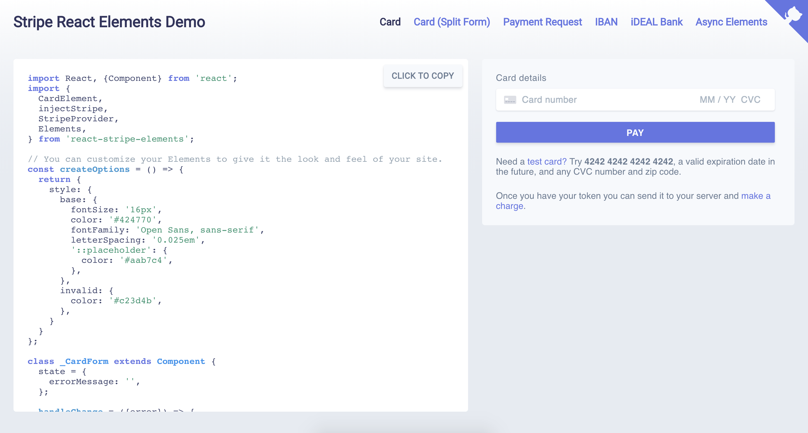

# react-stripe-elements demo

This demo shows how you can use React Stripe Elements to create custom payment experiences.

You can see it live on [https://stripe.github.io/react-stripe-elements](https://stripe.github.io/react-stripe-elements).



We have demos of the following elements:
- [`CardElement`](https://stripe.github.io/react-stripe-elements/#card)
- [`CardNumberElement`](https://stripe.github.io/react-stripe-elements/#split-card)
- [`CardExpiryElement`](https://stripe.github.io/react-stripe-elements/#split-card)
- [`CardCVCElement`](https://stripe.github.io/react-stripe-elements/#plit-card)
- [`PaymentRequestButtonElement`](https://stripe.github.io/react-stripe-elements/#payment-request)
- [`IbanElement`](https://stripe.github.io/react-stripe-elements/#iban)
- [`IdealBankElement`](https://stripe.github.io/react-stripe-elements/#ideal)
- [`Async Elements`](https://stripe.github.io/react-stripe-elements/#async) (an example of loading Stripe Elements asynchronously)

## Running locally

You can run this demo locally by cloning the react-stripe-elements repository.

### Download the source code

```shell
git clone https://github.com/stripe/react-stripe-elements
cd react-stripe-elements/demo
```

### Run the server
```shell
# (make sure you have yarn installed: https://yarnpkg.com/)

yarn install
yarn start
```

### See it deployed!
Go to <http://localhost:3000/> to try it out. 

The [Payment Request Button](http://stripe.github.io/react-stripe-elments/payment-request) page will not render unless the page is served over HTTPS. To demo the `PaymentRequestButtonElement`, you can tunnel over HTTPS to your local server using [ngrok](https://ngrok.com/) or a similar service.

If you have ngrok installed it's simple to serve the app over HTTPS:

```shell
ngrok http 3000
```

Once you run ngrok you can go to the forwarding URL they provide and see the [Payment Request Button](http://stripe.github.io/react-stripe-elments/payment-request). For example:

```shell
https://<example>.ngrok.io/payment-request
```

## Making changes to the hosted GitHub Page demo

We use the [gh-pages](https://github.com/tschaub/gh-pages) package to deploy this demo to the `gh-pages` branch.

When you make a change to the demo, be sure to reploy the built application:

```shell
cd demo
yarn run deploy
```